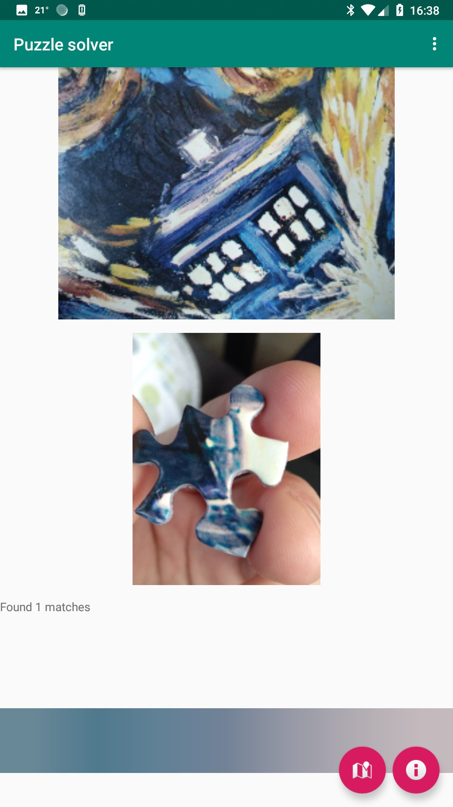

 
Solve jigwaws on Android

## How to use 

Take a picture of the full jigwaw 

Take a picture of the picture of a piece

The app will locate its position in the jigsaw, and it will place a red dot on the match.

